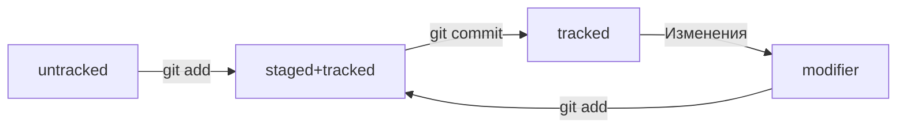

<<<<<<< HEAD

# **Практическое задание 1.**

#  Шпаргалка GIT

##  Терминал для Windows

### Основные команды терминала
#### С помощью параметра **-h** можно узнать дополнительные параметры каждой корманды

1. **pwd** - от англ. print working directory — «показать рабочую папку»
2. **cd** - (от англ. change directory — «сменить директорию»)
3. **~** - Обозначение домашней директории
4. **ls** - Вывести содержимое директории
5. **ls -a** - Просматривать содержимое вместе со скрытыми файлами и папками через 
6. **touch, mkdir** - Создание файлов и директорий
7. **cp** - Копирование файлов
8. **mv** - Перемещение файлов и папок
9. **cat** - Чтение файлов
10. **rm, rmdir, rm -r** - Удаление файлов и папок


## Операции с GIT

1. **git init** -  Сделать папку репозиторием
2. **rm -rf .git** - «Разгитить» папку, если что-то пошло не так. Если вы случайно сделали Git-репозиторием не ту папку, её можно «разгитить». Для этого нужно удалить скрытую подпапку .git.

3. **git status** - Проверить состояние репозитория
4. **git add** - Подготовить файлы к сохранению
5. **git commit** - Выполнить коммит
6. **git commit -m ‘Мой первый коммит!’** - Создаст коммит с коментарием "Мой первый коммит!"
7. **Ещё раз о разнице между git add и git commit** - Сначала команда git add сообщает Git, какие именно файлы нужно сохранить и какую их версию. Затем с помощью команды git commit происходит само сохранение. 
8. **git log** - Просмотреть историю коммитов


## ```SSH```
### Генерация ssh - ключа 

1. Для генерации SSH-пары можно использовать программу ssh-keygen. Откройте терминал и введите следующую команду.

```$ ssh-keygen -t ed25519 -C "электронная почта, к которой привязан ваш аккаунт на GitHub"```

 Используйте электронную почту, к которой привязан ваш GitHub-аккаунт.
    Если вы видите сообщение об ошибке, то, скорее всего, ваша система не поддерживает алгоритм шифрования ed25519. Ничего страшного: используйте другой алгоритм.

``` $ ssh-keygen -t rsa -b 4096 -C "электронная почта, к которой привязан ваш аккаунт на GitHub" ```

 После ввода отобразится такое сообщение.

```> Generating public/private rsa key pair. # сгенерированы публичный и приватный ключи```


2. Укажите место хранения ключей. Простой вариант — сделать домашний каталог пользователя путём по умолчанию. Для этого нажмите ```Enter```

 Теперь в указанной директории появится пара ключей.

3. Программа запросит кодовую фразу (англ. passphrase) для доступа к SSH-ключу. Вы можете оставить поле пустым. Для этого нажмите ```Enter```, а затем ещё раз Enter для подтверждения.

Как бы странно ни звучало, кодовая фраза — это «пароль от ключа». Представьте, что SSH-ключ лежит в шкатулке. А на самой шкатулке — кодовый замок, который открывается кодовой фразой.
Многие пользователи Git не используют кодовую фразу для защиты своего SSH-ключа. Если такой фразы нет, то её не нужно вводить всякий раз при взаимодействии с удалённым репозиторием.
С другой стороны, применение кодовой фразы усиливает безопасность ключей. Если вы используете эту фразу, ключ будет надёжно защищён в случае несанкционированного доступа к вашему компьютеру.

4. Готово! Теперь осталось проверить, что ключи действительно сгенерировались. Для этого вызовите эту команду.

```ls -a ~/.ssh```

На экране должны появиться два файла — один с расширением ```.pub```, другой — без. Файл в ```.pub``` — публичный, им можно делиться с веб-сайтами или коллегами. Файл без расширения ```.pub``` — приватный. Ни в коем случае не передавайте его никому! 


# **Практическое задание 2.**

### Хеш — идентификатор коммита

```Хеширование``` - это способ преобразовать набор данных и получить их «отпечаток»

Информация о коммите — это набор данных: когда был сделан коммит, содержимое файлов в репозитории на момент коммита и ссылка на предыдущий, или родительский (англ. parent), коммит.

Обычно хеш — это короткая (40 символов в случае SHA-1) строка, которая состоит из цифр 0—9 и латинских букв A—F (неважно, заглавных или строчных). Она обладает следующими важными свойствами:

- если хеш получить дважды для одного и того же набора входных данных, то результат будет гарантированно одинаковый;

- если хоть что-то в исходных данных поменяется (хотя бы один символ), то хеш тоже изменится (причём сильно).


### Хеш — основной идентификатор коммита

Git хранит таблицу соответствий хеш → информация о коммите. Если вы знаете хеш, вы можете узнать всё остальное: автора и дату коммита и содержимое закоммиченных файлов. Можно сказать, что хеш — основной идентификатор коммита.


```git log``` - появляется список коммитов.

```git log --oneline``` - В терминале появятся только первые несколько символов хеша каждого коммита и их комментарии.

## Статусы файлов в Git

Одна из ключевых задач Git — отслеживать изменения файлов в репозитории. Для этого каждый файл помечается каким-либо статусом.

Статусы ```untracked```/```tracked```, ```staged``` и ```modified```

- ```untracked``` - неотслеживаемый
Мы говорили, что новые файлы в Git-репозитории помечаются как ```untracked```, то есть неотслеживаемые. Git «видит», что такой файл существует, но не следит за изменениями в нём. У ```untracked```-файла нет предыдущих версий, зафиксированных в коммитах или через команду ```git add```.

- ```staged``` - подготовленный
После выполнения команды ```git add``` файл попадает в staging area (от англ. stage — «сцена», «этап [процесса]» и area — «область»), то есть в список файлов, которые войдут в коммит. В этот момент файл находится в состоянии ```staged```.
  В одном из предыдущих уроков мы сравнили коммит с фотографией. Можно развить эту аналогию и сказать, что команда ```git add``` добавляет персонажей (текущее содержимое файла или нескольких файлов) на сцену (англ. stage) для общей фотографии, а ```git commit``` делает снимок всей сцены целиком. 

- ```tracked``` - отслеживаемый
Состояние ```tracked``` — это противоположность ```untracked```. Оно довольно широкое по смыслу: в него попадают файлы, которые уже были зафиксированы с помощью ```git commit```, а также файлы, которые были добавлены в staging area командой ```git add```. То есть все файлы, в которых Git так или иначе отслеживает изменения.

- ```modified``` - изменённый
Состояние ```modified``` означает, что Git сравнил содержимое файла с последней сохранённой версией и нашёл отличия. Например, файл был закоммичен и после этого изменён.


## Типичный жизненный цикл файла в Git

Может показаться, что файлы в репозитории попадают в разные состояния хаотично. На практике это не так, и у большинства файлов вполне предсказуемый путь.



1. Файл только что создали. Git про него ещё ничего не знает. Состояние: ```untracked```.
2. Файл добавили в staging area с помощью ```git add```. Состояние: ```staged``` (+ ```tracked```).
  - Возможно, изменили файл ещё раз. Состояния: ```staged```, ```modified``` (+ ```tracked```).
Обратите внимание: staged и modified у одного файла, но у разных его версий.

  - Ещё раз выполнили ```git add```. Состояние: ```staged``` (+ ```tracked```).

3. Сделали коммит с помощью ```git commit```. Состояние: ```tracked```.
4. Изменили файл. Состояние: ```modified``` (+ ```tracked```).
5. Снова добавили в staging area с помощью ```git add```. Состояния: ```staged``` (+ ```tracked```).
6. Сделали коммит. Состояния: ```tracked```.
7. Повторили пункты 4-7 много-много раз.


## Как читать git status

Частая ошибка при использовании Git — закоммитить лишнее или, наоборот, забыть добавить важный файл в коммит. Этого легко избежать, если не забывать проверять статусы файлов с помощью команды git status. Как читать её вывод, покажем в этом уроке.

### ```git status``` показывает следующие состояния файлов:

- ```staged``` (```Changes to be committed``` в выводе ```git status```);
- ```modified``` (```Changes not staged for commit```);
- ```untracked``` (```Untracked files```).


## Как исправить коммит

Иногда в только что выполненном коммите нужно что-то поменять: например, добавить ещё пару файлов или заменить сообщение на более информативное.

 - Дополнить коммит новыми файлами — ```git add main.html``` (добавили в список на коммит) ```git commit --amend --no-edit``` (изменили коммит добавив файл)

 - Изменить сообщение коммита — ```git commit --amend -m "Новое сообщение"```
 
 - Изменить можно только последний добавленный коммит


 # Как откатиться назад, если «всё сломалось»

### Выполнить unstage изменений — ```git restore --staged <file>```

Допустим, вы создали или изменили какой-то файл и добавили его в список «на коммит» (staging area) с помощью ```git add```, но потом передумали включать его туда. Убрать файл из staging поможет команда ```git restore --staged <file>``` (от англ. restore — «восстановить»).

Чтобы «сбросить» все файлы из ```staged``` обратно в ```untracked```/```modified```, можно воспользоваться командой ```git restore --staged .```: она сбросит всю текущую папку (```.```).

## «Откатить» коммит — ```git reset --hard <commit hash>```

Иногда нужно «откатить» то, что уже было закоммичено, то есть вернуть состояние репозитория к более раннему. Для этого используют команду ```git reset --hard <commit hash>``` (от англ. reset  — «сброс», «обнуление» и hard — «суровый»).

## «Откатить» изменения, которые не попали ни в staging, ни в коммит, — ```git restore <file>```

Может быть так, что вы случайно изменили файл, который не планировали. Теперь он отображается в ```Changes not staged for commit``` (```modified```). Чтобы вернуть всё «как было», можно выполнить команду ```git restore <file>```.

Изменения в файле «откатятся» до последней версии, которая была сохранена через ```git commit``` или ```git add```.


## «Откатить» изменения, которые не попали ни в staging, ни в коммит, — ```git restore <file>```

Может быть так, что вы случайно изменили файл, который не планировали. Теперь он отображается в ```Changes not staged for commit``` (```modified```). Чтобы вернуть всё «как было», можно выполнить команду ```git restore <file>```.

Изменения в файле «откатятся» до последней версии, которая была сохранена через ```git commit``` или ```git add```.


## «Откатить» изменения, которые не попали ни в staging, ни в коммит, — ```git restore <file>```

Может быть так, что вы случайно изменили файл, который не планировали. Теперь он отображается в ```Changes not staged for commit``` (```modified```). Чтобы вернуть всё «как было», можно выполнить команду ```git restore <file>```.

Изменения в файле «откатятся» до последней версии, которая была сохранена через ```git commit``` или ```git add```.


# Шпаргалка. Работа с ветками

В этой шпаргалке мы собрали все ключевые команды модуля — они наверняка пригодятся вам в реальной работе с ветками!

## Клонирование чужого репозитория
git clone git@github.com:YandexPraktikum/first-project.git (от англ. clone, «клон», «копия») — склонируй репозиторий с URL first-project.git из аккаунта YandexPraktikum на мой локальный компьютер.

## Создание веток

git branch feature/the-finest-branch (от англ. branch, «ветка») — создай ветку от текущей с названием feature/the-finest-branch;
git checkout -b feature/the-finest-branch — создай ветку feature/the-finest-branch и сразу переключись на неё.

## Навигация по веткам

git branch (от англ. branch, «ветка») — покажи, какие есть ветки в репозитории и в какой из них я нахожусь (текущая ветка будет отмечена символом *);
git branch -a — покажи все известные ветки, как локальные (в локальном репозитории), так и удалённые (в origin, или на GitHub).
git checkout feature/br — переключись на ветку feature/br.

Если нужно клонировать удаленный репозиторий со всеми ветками нужно после:

```git clone PATH```
сделать:

```git checkout [имя_другого_НЕ_мастер_бранча]```

## Сравнение веток

git diff main HEAD (от англ. difference, «отличие», «разница») — покажи разницу между веткой main и указателем на HEAD;
git diff HEAD~2 HEAD — покажи разницу между тем коммитом, который был два коммита назад, и текущим.

##Удаление веток

git branch -d br-name — удали ветку br-name, но только если она является частью main;
git branch -D br-name — удали ветку br-name, даже если она не объединена с main.
Слияние веток
git merge main (от англ. merge, «сливать», «поглощать») — объедини ветку main с текущей активной веткой. 

## Работа с удалённым репозиторием

git push -u origin my-branch (от англ. push, «толкнуть», «протолкнуть») — отправь новую ветку my-branch в удалённый репозиторий и свяжи локальную ветку с удалённой, чтобы при дополнительных коммитах можно было писать просто git push без -u;
git push my-branch — отправь дополнительные изменения в ветку my-branch, которая уже существует в удалённом репозитории;
git pull (от англ. pull, «вытянуть») — подтяни изменения текущей ветки из удалённого репозитория.

'''Вы уже преодолели половину курса. Надеемся, что вам с нами интересно!'''
